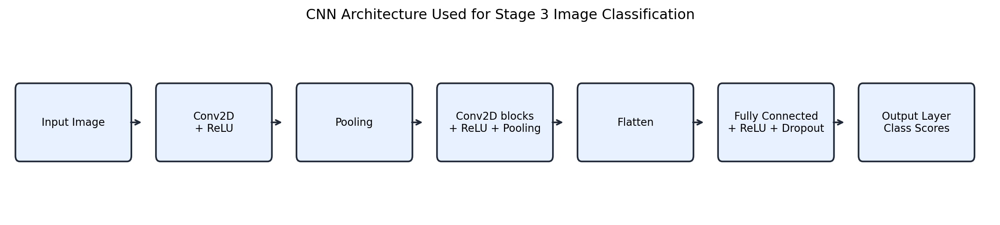
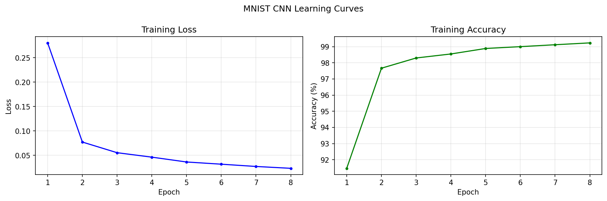
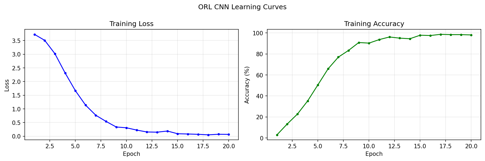
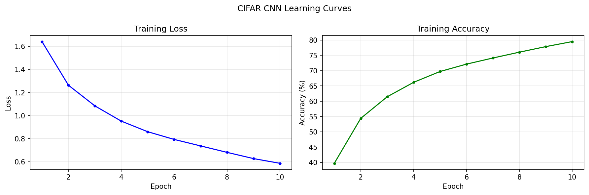

# ECS 170 Artificial Intelligence

## Spring 2026 Course Project: Stage 3 Report

## Team Information

**Team Name:** python pookies

**Student 1:** Miguel Beltran  
**Student 1 ID:** 922433771  
**Student 1 Email:** mmbeltran@ucdavis.edu

**Student 2:** Himani Manjunath  
**Student 2 ID:** 923180010  
**Student 2 Email:** hmanjunath@ucdavis.edu

**Student 3:** Nithya Sunku  
**Student 3 ID:** 923186959  
**Student 3 Email:** nsunku@ucdavis.edu

## Section 1: Task Description

This stage uses convolutional neural networks for image classification. We trained CNN models on three datasets: MNIST handwritten digits, ORL human faces, and CIFAR-10 colored objects. The goal was to classify test images correctly and compare how different CNN settings affect performance.

## Section 2: Model Description

The model is a CNN implemented in PyTorch. It uses convolution layers to extract image features, ReLU activations for nonlinearity, pooling layers to reduce feature map size, and fully connected layers for final classification. One configurable CNN class was used for all datasets, with different settings for each dataset.



## Section 3: Experiment Settings

### 3.1 Dataset Description

The datasets were already split into training and testing sets.

| Dataset | Task | Image Shape | Classes | Train Size | Test Size |
|---|---|---:|---:|---:|---:|
| MNIST | Digit recognition | 1 x 28 x 28 | 10 | 60,000 | 10,000 |
| ORL | Face recognition | 1 x 112 x 92 | 40 | 360 | 40 |
| CIFAR-10 | Object recognition | 3 x 32 x 32 | 10 | 50,000 | 10,000 |

MNIST contains grayscale digit images. ORL contains face images; although the original file stores three channels, the channels are equal grayscale values, so one channel was used. CIFAR-10 contains color images, so all three RGB channels were used.

### 3.2 Detailed Experimental Setups

All experiments used PyTorch default layer initialization. Images were converted to channel-first format and pixel values were scaled by dividing by 255. The main models used Adam optimization and cross-entropy loss.

| Dataset | Conv Channels | Hidden Dim | Epochs | Batch Size | Optimizer | Loss |
|---|---:|---:|---:|---:|---|---|
| MNIST | 32, 64 | 128 | 8 | 128 | Adam | Cross Entropy |
| ORL | 16, 32 | 128 | 20 | 32 | Adam | Cross Entropy |
| CIFAR-10 | 32, 64, 128 | 256 | 10 | 128 | Adam | Cross Entropy |

The reported experiments were run on CPU. The code can also use CUDA or MPS automatically if available.

### 3.3 Evaluation Metrics

We used accuracy, precision, recall, and F1 score.

```text
Accuracy = Number of Correct Predictions / Total Number of Predictions
Precision = True Positives / (True Positives + False Positives)
Recall = True Positives / (True Positives + False Negatives)
F1 Score = 2 * (Precision * Recall) / (Precision + Recall)
```

Because these are multiclass tasks, precision, recall, and F1 score were computed across classes using macro and weighted averages. The tables below report weighted values.

### 3.4 Source Code

Source code:

```text
[Insert GitHub repository link here]
```

Important files:

```text
script/stage_3_script/script_cnn.py
src/stage_3_code/method_cnn.py
src/stage_3_code/dataset_loader.py
```

### 3.5 Training Convergence Plot

The learning curves show training loss and training accuracy over epochs. The loss generally decreases, showing that the CNN models converged during training.

**MNIST**



**ORL**



**CIFAR-10**



### 3.6 Model Performance

| Dataset | Accuracy | Precision Weighted | Recall Weighted | F1 Weighted |
|---|---:|---:|---:|---:|
| MNIST | 0.9897 | 0.9898 | 0.9897 | 0.9897 |
| ORL | 0.9250 | 0.8875 | 0.9250 | 0.9000 |
| CIFAR-10 | 0.7440 | 0.7439 | 0.7440 | 0.7424 |

MNIST performed best because digit images are clean and structured. ORL also performed well, but the test set is small. CIFAR-10 was harder because the images have more object and background variation.

### 3.7 Ablation Studies

We changed CNN settings to compare their effect on performance. MNIST used a wider set of ablations. ORL and CIFAR-10 used the main architecture changes to keep the comparison shorter.

**MNIST Ablation Results**

| Configuration | Accuracy | F1 Weighted |
|---|---:|---:|
| Baseline | 0.9869 | 0.9869 |
| Deeper Network | 0.9907 | 0.9907 |
| Wider Hidden Layer | 0.9915 | 0.9915 |
| Larger Kernel | 0.9911 | 0.9911 |
| No Padding | 0.9868 | 0.9868 |
| Larger Stride | 0.9799 | 0.9799 |
| Average Pooling | 0.9885 | 0.9885 |
| MSE Loss | 0.9890 | 0.9890 |
| SGD Optimizer | 0.9865 | 0.9865 |

**ORL Ablation Results**

| Configuration | Accuracy | F1 Weighted |
|---|---:|---:|
| Baseline | 0.9250 | 0.9000 |
| Deeper Network | 0.9500 | 0.9333 |
| Wider Hidden Layer | 0.9500 | 0.9333 |
| Larger Kernel | 0.9500 | 0.9333 |

**CIFAR-10 Ablation Results**

| Configuration | Accuracy | F1 Weighted |
|---|---:|---:|
| Baseline | 0.7098 | 0.7095 |
| Deeper Network | 0.6896 | 0.6872 |
| Wider Hidden Layer | 0.7185 | 0.7170 |
| Larger Kernel | 0.7190 | 0.7140 |

For MNIST, the wider hidden layer performed best. For ORL, the deeper network, wider hidden layer, and larger kernel all improved performance. For CIFAR-10, the wider hidden layer and larger kernel slightly improved over the ablation baseline, while the deeper network performed worse.
